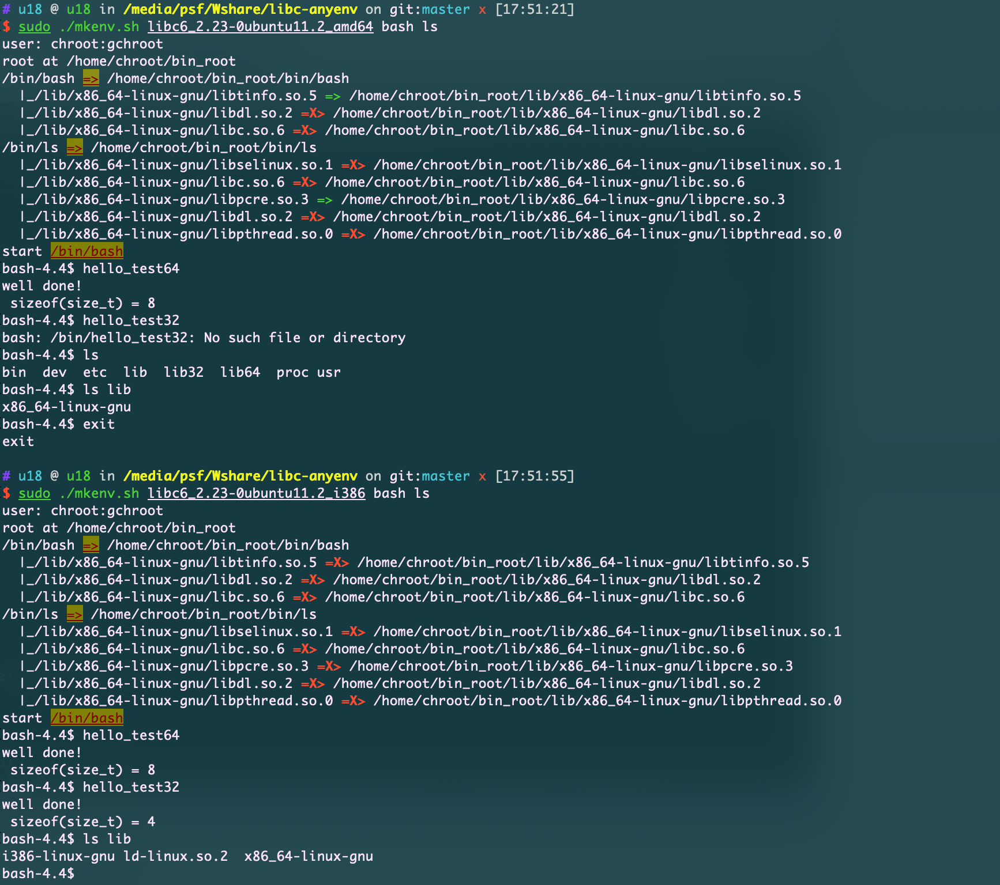
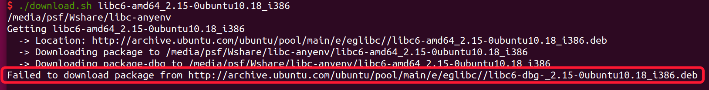
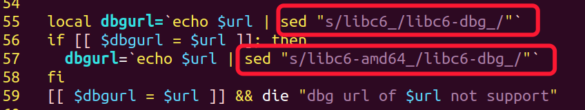

# libc-anyenv

------

一个快速搭建任何版本环境的工具，使用chroot具备环境隔离的功能；
另外包含ida自动加载DWARF符号功能（完美f5）、被调试程序输入输出重定向等功能，侵入性低所有版本ida均适用；
适合IDA调试**病毒**和**PWN**

# instation

------

## setup

**vim setup.sh**
修改安装路径（最好指定到当前已有的环境，无破坏）

**LibcSearcher**="$HOME/.local/LibcSearcher"
**libcdatabase**="$HOME/libc-database"

```bash
$ ./setup.sh 
```

检查当前目录是否含有**db**文件夹链接到正确 **libc-database/db**


## download

```bash
$ ./download.sh <libc6-id>
           like $./download libc6_2.23-0ubuntu11.2_amd64
```


将会安装DWARF符号到 $bin_root/usr/lib/debug/.build-id , 方便gdb or ida
将库解压到 **<libc6-id>**目录


## Make env

```bash
$ ./mkenv.sh -h
--- help ---
sudo ./mkenv.sh <libc6-id> <main_bin> [ dep_bins ... ]  -- Program execution in any environment
sudo ./mkenv.sh uninstall   -- uninstall the change_root
example: sudo ./mkenv.sh libc6_2.23-0ubuntu11.2_amd64 bash linux_server64 sh ls cat id

```



 **lib 32&64 mix it all up**

# ida调试能力增强

------

**td2socket.so**

```bash
$ ln -s `which clang-10` /usr/bin/clang
$ cd ida-upup && make clean && make
```


## 功能1

IDA远程调试的**linux_server**和其调试**目标程序**的**标准输入输出分开**

**目标程序**的**标准输入输出可以 重定向到socket**


### **阻塞模式** 

**`LD_PRELOAD=[path to std2socket.so] BLOCK= ./linux_server`**


### **非阻塞模式**

将 `BLOCK=`去掉


阻塞模式就是一定要有`pwntools remote`上了server那么ida才会响应执行；否则，如果无remote连接请求, 和server原来那样直接输入输出到混一起

## 功能2

ubuntu、debian系统库（含libc6）环境 **全符号** 调试支持。

一般来说libc的DWARF是分离出去的，需要安装libc6-dbg , 路径为`/usr/lib/debug/lib/x86_64-linux-gnu`
 ida默认会从so库直接加载DWARF文件, 由于符号分离，所以就加载失败。

分析linux_server后，发现其支持自动加载DWARF文件（含优先级），但是路径为空（格式: **path1;path2;....**），需要指定。

1. 配合**download.sh**后会自动安装符号到**\<libc6-id\>/usr/lib/debug/.build-id**

2. **`LD_PRELOAD=[path to std2socket.so] BLOCK= ./linux_server** 开启调试

   不能是`LD_PRELOAD=[path to std2socket.so] BLOCK= ./xxx/linux_server`

   

3. **sudo -s** 

   **echo 0 > /proc/sys/kernel/randomize_va_space(必要条件)**  

   对pwn爷爷来说这也是本方法的一个弊端，但是问题不大。

4. **lunch ida > moudle > choose libc.so.6 > load symbols > debug > take snapshot > enable source-debug level > save database**

   load symbols将会花费你几分钟时间，但是之后将会是1秒钟。

   

5. **可以配合上面的chroot，所有版本的库都能支持符号加载 ！**


# Error:

Sorry，根据libc-id去定位libc-dbg-id是困难的，你可以访问如上`http://archive.ubuntu.com/ubuntu/pool/main/e/eglibc/` 

搜索`2.15-0ubuntu10.18_i386` 的dbg项目

将转换规则添加到download.sh

